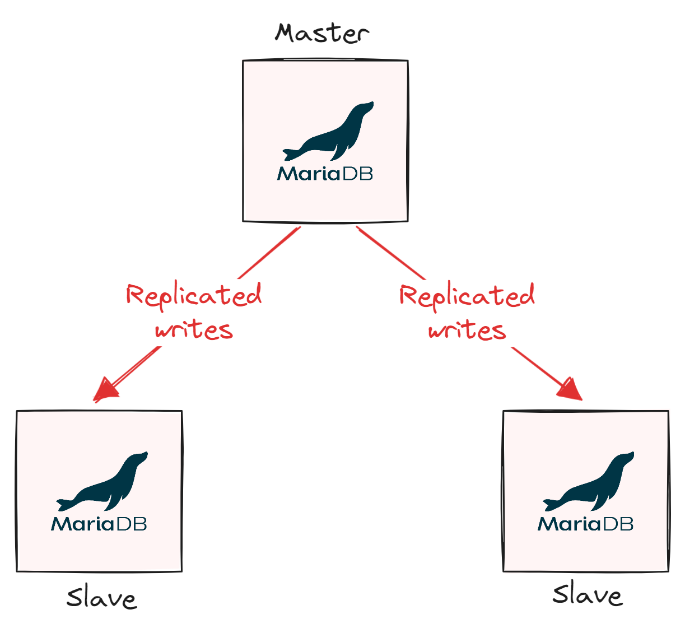
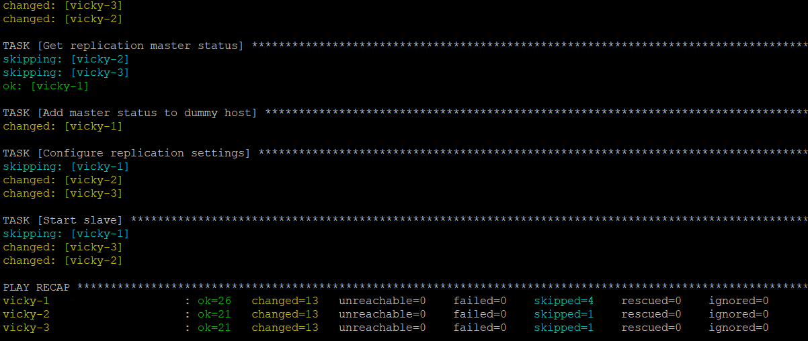

# MariaDB Replication Cluster ⚙️
[](https://github.com/vickyphang/mariadb-replication-setup/blob/master/LICENSE)


<p align="center">  </p>

The `mariadb-replication-setup` project is designed to deploy `MariaDB master-slave replication clusters` on `Ubuntu` (both `focal` and `jammy`). This solution is tailored for use on dedicated physical servers, virtual machines, and within both on-premises and cloud-based infrastructures.

This project currently only facilitates the `creation` of new clusters.

---

### MariaDB Master-Slave Replication Topology
<p align="center">  </p>


## Requirements
This playbook requires `root privileges` or `sudo`.


## Deployment: quick start
1. Install `ansible` on control node
```bash
apt update && apt install -y ansible
```

2. Clone this repository
```bash
git clone https://github.com/vickyphang/mariadb-replication-setup
```

3. Edit the inventory file
##### Specify hostname, IP addresses (`ansible_host`) and connection settings (`ansible_user`, `ansible_ssh_pass` or `ansible_ssh_private_key_file` for your environment
```bash
nano inventory
```

4. Edit the variable file vars/main.yml
```bash
nano vars/main.yml
```
Minimum set of variables:
- `mariadb_version`
- `mariadb_replication_user` # user to connect to the Master server and request binary logs
- `mariadb_replication_password`
- (Optional) `create_user` # if set to `true`, create new user. must fill `mariadb_user`, `mariadb_password`, `mariadb_host`

5. Try to connect and ping to all hosts
```bash
ansible all -m ping
```

6. Run playbook
```bash
ansible-playbook deploy_cluster.yml
```
<p align="center">  </p>